# Etude Exploratoire de données (Explororatory Data Analysis) 

 ## Evaluer les tendances sur le marché de la location à courte durée de l'entreprise AirBnB 


## Aperçu (Overview)
Bienvnu(es) dans sur ce projet d'analyse exploratoire de données centré sur les données de d'activité de l'entreprise AirBnB. Le but dans un premier temps  ici est de comprendre comment se comporte le marché de l'immobilier rapide, les reservations de petites appartements pour vacanciers, la disponibilité des appartements, mais il s'agit aussi de comprendre les periodes et les regions les plus attractives, et deuxièmement de comprendre les tendences sociologiques ou économiques autour du marché de la location à petit prix. Ce jeux de données a été obtenu de la plateforme centralisée Kaggle.


### Les quetions : 
Pour éssayer de comprendre le but de ce travail j'ai résumé à mon avis les questions les plus pertinentes relatives à l'activité de cette entreprise, pour en comprendre la dynamique et les tendences majeures, en me basant sur les précédentes Analyses exploratoire de données que j'ai déjà réalisé surtout dans le cas de la performance marketing.
J'en ai listé 10 principales qui sont de savoir:

1. En sommaire: Le nombre de propriétés disponibles pour la location, le revenu total estimé, prix, la durée  moyen de location d'une appart. Les indicateurs clé de performance et leurs évolution dans le temps.
2. Quels sont les localiations qui sont les plus fréquentées?
3. Quel est le revenu estimé par type de de propriété ? par voisinage ? ou par quartier ?
4. Quelle est la croissance moyenne des prix? Existe t-il des facteurs qui influençent ces prix ? La progression temporelle des prix, des réservations ?
5. Quels sont les types de propriétés  les plus démandés? à quel moment? dans quel zone (pays, ville, régions, district) ?
6. Existent-ils des Hôtes récurents ? ou des propriétés récurrentes qui reviennent dans les demandes de réservations ? 
7. Quels caractéristiques sont le plus demandées pour les propriétés les plus sollicitées ?
8. Qui sont les propriétaires ou les hôtes  ayant le plus grand score de locations, avec le taux de satisfaction client  le plus élevé?
9. La contribution au CA par type de propriété, par localisation de la propriété ? par hôtes ? étude temporelle
10. Insights et recommandations.


## Les outils 
Pour mon analyse j'ai utilisé les outils de base dans l'analyse des données 
**Python** la colonne vertebrale de mon analyse qui m'a permis de faire toutes les opérations de traitements et de nettoyage, l'enrichissement, les prévisions en me basant sur les libraiiries suivantes:
- **Pandas** pour analyser les données de façon générale
- **Matplotlib/Seabon** visualiser les données et personnaliser certains graphiques avancées
- **Jupiter Notebooks** dans l'outils pour exécuter mes scripts Python et écrire ces notes d'analyse
- **Visual Studio Code/Gooogle Colab** mon environnement de developpement intégré python
- **SQL SERVER 22** pour construire les vues et les visualisations de perfomances categorielles
- **Power BI** Pour construire le dashboard interactif de ce projet
- **Git et GitHub** qui sont les deux technologies ésentielles pour le partage de mes analyses et mon code pour s'assurer d'éventuelle collaboration et le tracking du projet.

# L'Analyse: 
pour des soucis de compréhesion et de communication j'ai documenté certaines des opérations dans un but purement promotionnel à defaut d'avoir les informations complètes de l'entreprise, et fais certains choix, qui ne relevent que d'une stratégie personnelle 
le notebook complet ici: 
 [AirBnB_datas](AirBnb.ipynb).

## Préparation des données et Nettoyage
Cette section contient les étapes de de préparation, de collecte et de conformité ou d'utilisabilité des données.

- Premierement se connecter à la source de données Kaggle (https://kaggle.com)
- Ensuite charger le jeux de données (C:\Users\Big Ur\Desktop\Big Data_Projects\Airbnb_Data) dans mon Notebook.

- les bibliothèques Python spécialisées pour mon analyse

```python
import ast
import pandas as pd
import seaborn as sns
from datasets import load_dataset
import matplotlib.pyplot as plt  
from statsmodels.tsa.arima.model import ARIMA
from statsmodels.tsa.statespace.sarimax import SARIMAX

chargement des données:

BASE_DIR=Path.cwd().parent
file_path=BASE_DIR/'Airbnb_Data/Listings_data_dictionary.csv'
#print('Resolved path :', file_path.resolve())
df_airbnb=pd.read_csv('Airbnb_Data/Listings_data_dictionary.csv')
df_Listings=pd.read_csv('Airbnb_Data/Listings.csv', encoding='latin1')
df_reviews=pd.read_csv('Airbnb_Data/Reviews.csv')
df_rev_datas=pd.read_csv('Airbnb_Data/Reviews_data_dictionary.csv')

NB: Ici l'instruction BASE_DIR est utilisé pour résoudre un problème de chemin d'accès

```
Je dois reconnaitre que la préparation et le nettoyade des données a été particulièrement chronophage et exigeante étant donné du grand nombre de données incohérentes et abérrantes du jeux de données, ce qui est en général le cas dans le monde réel.  d'où ll'importance à l'avenir des règles sctictes de validation et de conformité des données.    

- Deuxièmement la compréhension des données. A quoi s'attendre avant de commencer l'analyse ?

```python
print(df_airbnb.head())
print(df_Listings.head())
print(df_reviews.head())
print(df_rev_datas.head())

```
Et j'ai ensuite enchaîné avec la verification des valeurs nulles, et le format correct des types de données. Pour éviter les problèmes de compatibilité avec Power BI ou SQL Server telle qu'avec l'argument *encoding='latin1'* lors du chargement du dataset df_listings.


```python
- Par application de la fonction describe: df.describe() à tous les jeux de données.
- la fonction df.info()
- # s'assurer du correct format des dates pour toutes les colonnes de type datetime de mes jeux de données
df_Listings['host_since']=pd.to_datetime(df_Listings['host_since'])
type(df_Listings['host_since'])
- Ensuite créer une colonne mois pour les analyses mensuelles plus précises partout.

df_Listings['month_listing']=df_Listings['host_since'].dt.strftime('%B')
df_Listings.columns

- Ensuite regrouper les colonnes au format numérique et les colonnes catégorielles 
- Pour la gestion des valeurs nulles, avec les colonnes catégorielles j'\n'ai remplacé les valeurs nulles en procédant ainsi:
Retirer ces valeurs si les valeurs nulles correspondent à moins de 1% des valeurs de la colonne

catogorical_cols=['name','neighbourhood', 'city', 'property_type', 'room_type','amenities']
# replace the null values  
df_Listings.dropna(subset=['name'], how='any') # 0.05 null values in the name column
 et remplacer par la valeur la plus fréquence si ces valeurs représentent plus de 5%.

 for col in df_Listings.select_dtypes(include='object').columns:
    mode_value=df_Listings[col].mode()[0] # most frequent value
    df_Listings[col].fillna(mode_value,inplace=True)

```
Pour les colonnes de valeurs numériques:


```python
import numpy as np
df_Listings.copy()
#df_Listings.info()
num_cols=df_Listings.select_dtypes(include=[np.number])
for col in num_cols:
    df_Listings[col]=df_Listings[col].fillna(df_Listings[col].median())

#df_Listings.isnull().mean()*100 # drop categorical columns  where null values pct is under 1%, replace by mode values when pct is >=5%

Pour la gestion des colonnes au format dates c'\n'était beaucoup plus complexe: j'\n'ai remarqué la présence de plusieurs colonnes dont le mois d'\n'adhesion de l'\n'hôte correspondait au mois de juillet mais dont la colonne host_since était nulle ou vide. alors j'\n'ai remplacé les 165 valeurs nulles de cette colonne par une date aléatoire dont le mois de la transaction était "juillet" puisque les 165 Valeurs nullees étaient toutes de juillet.

df_Listings[df_Listings['host_since'].isna()].copy()
# let's replace the 165 host_since values by a random date with month matching to July
years=df_Listings['host_since'].dropna().dt.year.unique()
def random_july_from_years():
    year=np.random.choice(years)
    day=np.random.randint(1,32)
    return pd.Timestamp(year=year, month=7, day=day)

df_Listings['host_since']=df_Listings.apply(
    lambda row: random_july_from_years() if pd.isna(row['host_since']) else row['host_since'], axis=1
)

```

Après avoir terminé le nettoyage, j'ai effectué le chargment de ces données vers SQL Server pour la creation de vue, dans le but de simplifier la modelisation et les visualizations dans Power BI. Ici j'ai appelé la base AirBnB_Datas

```python
from sqlalchemy import create_engine
import psycopg2
import pyodbc

conn = pyodbc.connect(
    "Driver={ODBC Driver 18 for SQL Server};"
    "Server=localhost;"                  # ✅ Changement ici
    "Database=AirBnB_datas;"
    "Trusted_Connection=yes;"
    "TrustServerCertificate=yes;"
)

print("Connexion réussie !")

engine = create_engine(
    "mssql+pyodbc://localhost/AirBnB_Datas"
    "?driver=ODBC+Driver+18+for+SQL+Server"
    "&Trusted_Connection=yes"
    "&TrustServerCertificate=yes"
)

with engine.connect() as conn:
    print("Connexion SQLAlchemy réussie !")

df_airbnb.to_sql(
    name="air_bnb_dict",   # Nom de la table dans SQL Server
    con=engine,
    #schema="dbo",             
    if_exists="replace",        
    index=False                
    #chunksize=1000               
)
print("✅ Données envoyées avec succès !")


df_Listings.to_sql(
    name="Listings",   # Nom de la table dans SQL Server
    con=engine,
    #schema="dbo",             
    if_exists="replace",        
    index=False                
    #chunksize=1000               
)
print("✅ Données envoyées avec succès !")

df_rev_datas.to_sql(
    name="Reviews_Datas",   # Nom de la table dans SQL Server
    con=engine,
    #schema="dbo",             
    if_exists="replace",        
    index=False                
    #chunksize=1000               
)
print("✅ Données envoyées avec succès !")

```

## Créations des vues dans SQL Server pour une modélisation simplifiée dans Power BI

```python
- 1-Vue principale du profil des hôtes
create view vw_host_profiles as 
select 
	host_id, 
	host_since, 
	host_location,
	host_response_time,
	host_acceptance_rate,
	host_response_rate,
	host_is_superhost,
	host_total_listings_count,
	host_has_profile_pic,
	host_identity_verified
	from Listings;

2- Vue des Listings (appartements ou airbnbs)

alter view vw_listings_summary as  
select 
	listing_id,
	host_id,
	host_since,
	city,
	property_type,
	room_type,
	price,
	review_scores_accuracy,
	host_acceptance_rate,
	instant_bookable,
	month_listing, 
	DATEDIFF(year, host_since, GETDATE()) as Host_tenure
from Listings;

3- Vue des notations 
create view vw_review_score as 
select 
	listing_id,
	review_scores_rating,
	review_scores_accuracy, 
	review_scores_cleanliness,
	review_scores_checkin,
	review_scores_communication,
	review_scores_location,
	review_scores_value
from Listings;

4- Vues localisation
-- view location dimensions
create view vw_location_dims as 
select listing_id,
city,
district,
neighbourhood,
latitude,
longitude
from Listings;
```
#### Le but de la création ces vue était de faciliter la modelisation du model en étoile dans Power BI, avec la table principale de listing comme étant la table de fait centrale et les autres vues comme des tables de dimensions

### Une Remarque:
sur le code SQL de ce projet, je me suis confronté encore à un autre problème de typage, il y a effectivement eu des incompatibilité des données lors de l'import des données dans power BI, il a fallut les gérer depuis SQL Server plutôt qu'avec Power Query.

il s'est agit de la correction des colonnes de type Boolean. les valeurs de types 0 ou 1, t et f en donnée True or False .

```Python
	-- correction des valeurs booleans
	UPDATE dbo.Listings
SET host_is_superhost = CASE WHEN host_is_superhost = 0 THEN 'FALSE' ELSE 'TRUE' END;

UPDATE dbo.Listings
SET host_identity_verified = CASE WHEN host_identity_verified = 1 THEN 'TRUE' ELSE 'FALSE' END;

UPDATE dbo.Listings
SET host_has_profile_pic = CASE WHEN host_has_profile_pic = 1 THEN 'TRUE' ELSE 'FALSE' END;

UPDATE dbo.Listings
SET instant_bookable = CASE WHEN instant_bookable = 1 THEN 'TRUE' ELSE 'FALSE' END;

ALTER VIEW vw_listings_summary AS
SELECT 
    host_id,
    CAST(host_is_superhost AS BIT) AS host_is_superhost,
    CAST(host_identity_verified AS BIT) AS host_identity_verified,
    CAST(host_has_profile_pic AS BIT) AS host_has_profile_pic
FROM dbo.Listings;

```
## Résultats: 

### 1. En sommaire: Le nombre de propriétés disponibles pour la Région (localisation de l'hôte), le revenu total estimé, prix, la durée  moyen de location d'une appart. Les indicateurs clé de performance et leurs évolution dans le temps.

Au total il y a 164105 listings (appartements disponibles, c'est à dire qui sont immédiatment occupables)
- Nombre de propriété disponible par Région:

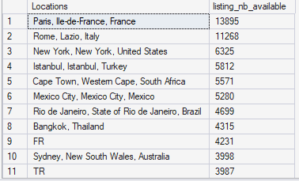

*Le nombre de propriétés disponibles par Région*

- Par voisinage ou par quartier il suffit d'appliquer les  différents types de filtre de localisation sur le type de graphique.

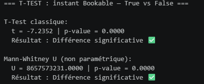

*Le nombre de propriété disponibles par région (localisation, ville)*

- Le revenu généré par type de propiété et par région
Pour le reste du projet j'ai considéré le Revenu généré comme le produit du prix de chaque propriété par le nombre de minimum de nuits par séjour

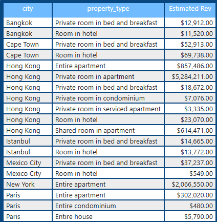

*Le Revenu minimum estimé par type de propriété, par ville et par voisinage*

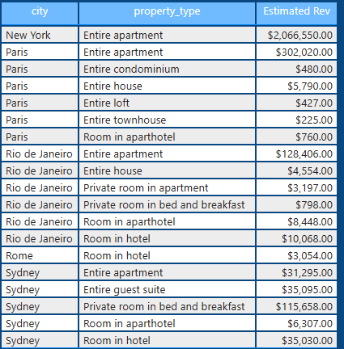

*Le Revenu minimum estimé par type de propriété, par ville*

### 2. Quels sont les localisations les plus fréquentées ?
Pour répondre à cette question j'ai juste évalué le revenu généré par localisation, plus le revenu était important, plus la destination ou la région était attractive

## Résulats:

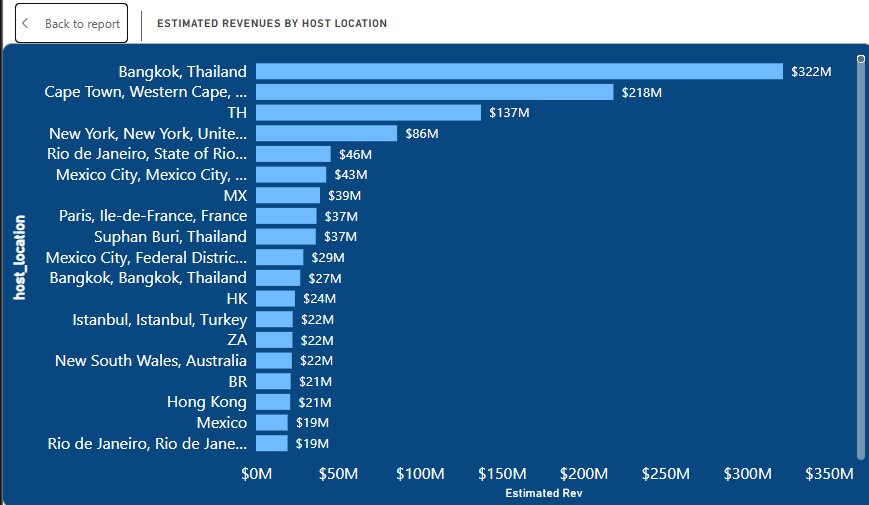

*Le Revenu minimum estimé par type de propriété, par ville*


**Les localisations les plus fréquentées sont celles qui génèrent le plus de revenus**

de manière générale sur la période considérée on remarque que les propriétés situé à Bangkok en Thailand sont les plus prolifiques en terme de revenu et donc les plus attractives. mais c'est un résulat plus mitigé en considérant le revenu annuel, par exemple entre 2008 et 2012, les destinations occidentales (New York, Londres, Paris, ..Sydney ...etc) ont été les plus attracctives; tandis qu'a partir de 2013 jusqu'en 2021 les destinations dites des BRiCS c'est à dire les pays émergents (Brésil, Afrique du Sud, Mexique, Singapour, ...etc) se sont montrées plus éfficaces

### 3. Comment évolue les prix des propriétés aucours du temps ?
Dans cette section il a fallut éclater segmenter l'étude en zone, en s'appuyant sur les variables catégorielles des données (localisation, le type de proprété, les ammenagements, la ville, profil ou les caractéristues de l'hôtes, Quelle est la croissance moyenne des prix? Existe t-il des facteurs qui influençent ces prix ? La progression temporelle des revenus, des prix, des réservations ?) pour faire ressortir les éventuels facteurs d'influence sur les performances de l'entreprise sur la période considérée.

#### 4. Commment évoluent les prix? Le prix moyen par propriété tout type confondu 
Le prix moyen par propriété est de *608.9 $*
pris individuellement, il clair que les villas entières sont les plus coûteuses.

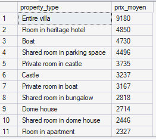

*Prix moyen par type de propriété*

- On remarque que les prix ont connu une croissance importante entre 2008 et 2010 jusquà atteindre une augmentation de plus de 300% en  Janvier 2010 pour finalement se stabiliser et redescendre à une croissance quasiment nulle entre 2011 et 2013. Un autre pic élevé de croissance a été observé en Décembre 2014, et redescendre progressivement à partir du troisième trimestre 2016 jusqu'à se stabiliser autour de 0.5 en 2021

### B. Pour ce qui sont des facteurs d'influence sur les prix et leur croissance en général on peut remarquer entre autres:
- De base les prix évoluent en fonction du type de propriétés, les villa et les appartement entier étaient les plus chers,ensuite plus le nombre de pièces était important, les prix étaient élevés dans les villes émergentes comme Cape Town, Rio, Mexico city, Instabul,  Hongkong. 
Pour confirmer ces observations j'ai procédé à des des tests de correlations statistiques entre les variables.

- Dans un premier temps, j'ai effecttué un test de normalité entre les variables numériques du jeux de données.
Pour voir si varialbes suivaient une distribution normale

```python
# B. Test de normalité shapiro (Evaluer la normalité des prix ou du nombre de listings par hôte, des deals (accomodates)
#  par rapport  aux  types de propriétés et aux régions)
#  1.  par rapport au type de propriétés sur les variables numériques
# creation d'une liste de variables contenant les colonnes numériques du DS
global_score=(df_corr['review_scores_accuracy']+ df_corr['review_scores_cleanliness']+ df_corr['review_scores_communication']+ df_corr['review_scores_location']+ df_corr['review_scores_value']+ df_corr['review_scores_checkin'])/5
df_corr['score']=global_score
variables = ['price', 'score', 'host_total_listings_count', 'accommodates']

print("=== TEST DE NORMALITÉ (Shapiro-Wilk) ===\n")
for var in variables:
    data = df_corr[var].dropna()
    # Shapiro sur échantillon (max 5000 observations)
    sample = data.sample(min(5000, len(data)), random_state=42)
    stat, p = shapiro(sample)
    print(f"{var}:")
    print(f"  Statistique W = {stat:.4f} | p-value = {p:.4f}")
    print(f"  Distribution : {'Normale ✅' if p > 0.05 else 'Non normale ❌'}\n")

```
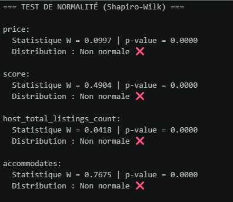

*Test de normalités entre les princiapales variables numériques*
Pour un échantillon de 5000 observations on remarque que les distributions sont anormales. ces variables n'ont aucune incidence les unes sur les autres.

### Test de normalité entre les prix et le nombre d'accord trouvé avec les hôtes
```python

# A. Test de normalité shapiro
# sur les variables numériques (score global, prix et accommodates (nombre d'accord trouvé par hôtes))
score_global=(df_corr['review_scores_accuracy']+ df_corr['review_scores_cleanliness']+ df_corr['review_scores_communication']+ df_corr['review_scores_location']+ df_corr['review_scores_value']+ df_corr['review_scores_checkin'])/5
df_corr['Score']=score_global
variables = ['price', 'Score', 'accommodates']

print("=== TEST DE NORMALITÉ (Shapiro-Wilk) ===\n")
for var in variables:
    data = df_corr[var].dropna()
    # Shapiro sur échantillon (max 5000 observations)
    sample = data.sample(min(5000, len(data)), random_state=42)
    stat, p = shapiro(sample)
    print(f"{var}:")
    print(f"  Statistique W = {stat:.4f} | p-value = {p:.4f}")
    print(f"  Distribution : {'Normale ✅' if p > 0.05 else 'Non normale ❌'}\n")

```
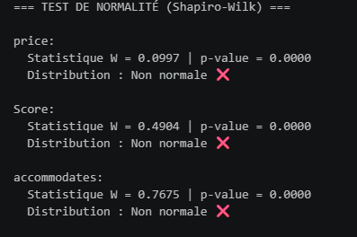

*Test de normalités entre prix, et nombre d'accord par hôtes*

De la même manière on obtient aucune normalité entre ces variables.

en prolongeant ce test à un test de comparaison entre deux groupes les propriétés immédiatement reservables et celles non reservables, en utilisant le test statistique MannWhthney

```python
# comparing test (two group comparison) : comparasion entre les listing bookables instanement et ceux non instanenement
from scipy.stats import ttest_ind, mannwhitneyu
# import matplotlib.pyplot as plt

bookables  = df_corr[df_corr['instant_bookable'] == 'f']['price'].dropna()
non_bookable = df_corr[df_corr['instant_bookable'] == 't']['price'].dropna()

print("=== T-TEST : instant Bookable — True vs False ===\n")

# T-Test (si distribution normale)
stat, p = ttest_ind(bookables, non_bookable)
print(f"T-Test classique:")
print(f"  t = {stat:.4f} | p-value = {p:.4f}")
print(f"  Résultat : {'Différence significative ✅' if p < 0.05 else 'Pas de différence significative ❌'}\n")

# Mann-Whitney (si non normale — plus robuste)
stat, p = mannwhitneyu(bookables, non_bookable, alternative='two-sided')
print(f"Mann-Whitney U (non paramétrique):")
print(f"  U = {stat:.4f} | p-value = {p:.4f}")
print(f"  Résultat : {'Différence significative ✅' if p < 0.05 else 'Pas de différence significative ❌'}")

```
#### Résultats:


*Test de comparaison entre instant_bookable and non_bookable listings*

Ici les différences sont significatives entres ces deux groupes de variables

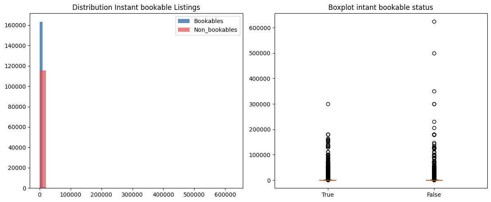

*Visualisation des Test de comparaison entre instant_bookable and non_bookable listings*

Il est clair que les propriétés disponibles immédiatement sont un peu plus coûteuses que les autres.

- Type de propriété par rapport au prix

Ici on évalue les 10 premiers types de propriétés les plus soliicitées par rapport au prix, en éffectuant des test d'analyse de variance (Annova)

```python
# Host acceptance rate and property_type comparison
from scipy.stats import f_oneway, kruskal

print("=== ANOVA : Property type par Price ===\n")
Top10_types=df_corr['property_type'].value_counts().head(10).index
df_top10 = df_corr[df_corr['property_type'].isin(Top10_types)]

groups = [
    df_top10[df_top10['property_type'] == types]['price'].dropna().head(30)
    for types in df_top10['property_type'].unique()
]

# ANOVA classique
stat, p = f_oneway(*groups)
print(f"ANOVA One-Way:")
print(f"  F = {stat:.4f} | p-value = {p:.4f}")
print(f"  Résultat : {'Différence significative entre type ✅' if p < 0.05 else 'Pas de différence ❌'}\n")

# Kruskal-Wallis (non paramétrique) compare independant groups 
stat, p = kruskal(*groups)
print(f"Kruskal-Wallis (non paramétrique):")
print(f"  H = {stat:.4f} | p-value = {p:.4f}")
print(f"  Résultat : {'Différence significative ✅' if p < 0.05 else 'Pas de différence ❌'}")

```

#### Résultat:
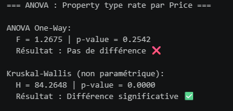

*Analyse de la vairance entre prix et type de propriétés*

La différence est réelle dans le cas d'une comparaison non paramétrique, et elle absente dans le cas d'une comparaison classique.

Pour terminer sur cette partie des facteurs d'influençe sur les prix,  j'ai éffectué un test de corrélations ciblé par pair avec la p_value qui est mesure la probabilité d'influençe des variables numériques importantes sur les prix des locations à savoir: le taux d'accord avec les hôtes, le nombre de chambres par listing, les scores (reviews), le nombre de nuits (durée d'occupation), le nombre de listings par hôtes..

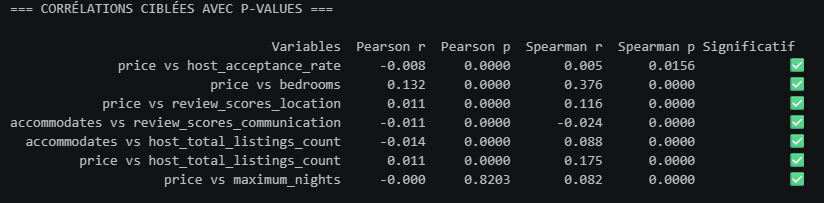

*Tests de corrélations ciblées avec la p_value*

Il apparaît que les corrélations sont significatives pour quasiment toutes les variables prises en considération dans ces tests.


### 5. Quelles sont les types de propriétés les plus demandées ou plus sollicitées ?

Pour répondre à cette question j'ai dans un premier temps évaluer l'occurence générale des différentes types de propriétés sur toutes la période d'activité. 

```python
df_corr['property_type'].value_counts()
```
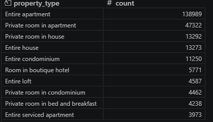

*Occurence des types de propriétés*

Ensuite filtrer le résultat sur les deux premiers types en termes d'occurences, (entire appartement et room in an appartement) en considérant chaque ligne comme une réservation, et pour finir évaluer les 5 premiers types de chaque

```python
 #Listing study by room_type category
# Listing filtered
df_filtered = df_corr[(df_corr['property_type'].isin(['Entire apartment', 'Private room in apartment']))].copy()
# Count occurrences of each property type (assuming each row = one unit booked)
property_type_counts = df_filtered.groupby(['property_type', 'room_type']).size().reset_index(name='counts')

# Get top 5 type per listings
top_retail = property_type_counts[property_type_counts['property_type'] == 'Entire apartment'].nlargest(5, 'counts')
top_technology = property_type_counts[property_type_counts['property_type'] == 'Private room in apartment'].nlargest(5, 'counts')

# combine both property_type in one 
# Combine and label
top_models = pd.concat([top_retail, top_technology])
top_models['label'] = top_models['property_type'] + " " + top_models['room_type']
color = top_models['property_type'].map({'Entire apartment': '#1f77b4', 'Private room': '#ff7f0e'})
```

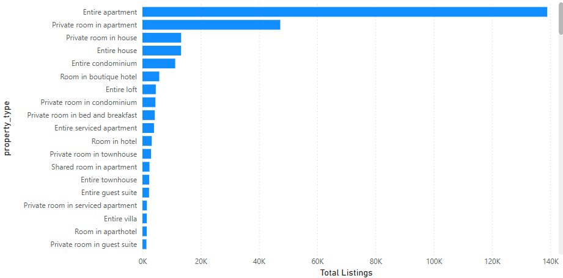

*Occurence des types de propriétés*

Il apparaît très que les appartement entiers et les chambres privées dans des appartements sont les types de propriétés les plus sollicitées, avec un revenu moyen par propriété disponible de 275 500 $ sur toute la période d'activité accompagné par un taux d'occupation de 30% et une courbe d'occupation temporelle ascendante.

#### Les régions les plus rentables c'est à dire là où on trouve de plus le types de propriétés les plus sollicitées sont alors réprésentées sur le graphique ci-dessous:


*Top des régions les plus rentables*


### 6. Les Hôtes et les types de propriétés récurrents ? celles et ceux qui reviennent énormemment dans les demandes de réservations

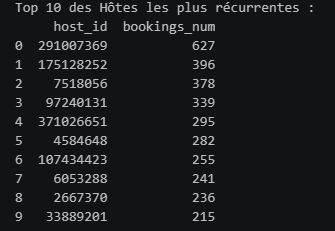

*Top 10 des Hôtes les plus récurrents*


*Top 10 des types de propriétés les plus récurrentes*

#### Les types de propriété avec le plus grands volume de reservations sont clairement les plus récurrentes, donc aussi les plus demandés par les occupants 


Il convient de compléter à ces obervations le taux de completion par hôte, c'est à dire le nombre d'accord trouvé par hôtes qui représenté par la colonne accommodates du dataset, représenté sur les graphiques ci-dessous:

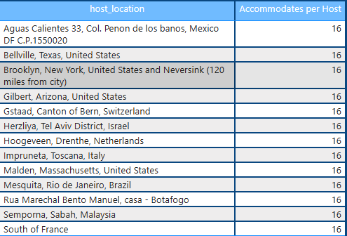

*Top 10 des hôtes avec le plus grand nombre de deals ou d'accord conclus*

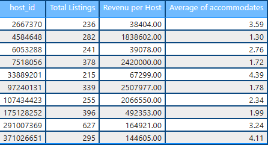

*Top 10 des hôtes avec le plus grand nombre de deals ou d'accord conclus par nombre de listings total*


#### 7. Les propriétaires ou les hôtes  ayant le  avec le taux de satisfaction client  le plus élevé?

Pour répondre à cette question j'ai procédé par deux approches: 
En créeant des mésures DAX pour chaque cas

- 1. J'ai évalué le nombre total de d'Hôtes ayant la mention "host_is_superhost"
- 2. J'ai listé les Hôtes ayant le plus grand score (review score global) 

#### Il y a au total 27 000 Hôtes avec le taux de satisfaction le plus élevé


*Le Nombre d'Hôtes avec le taux de satisfaction le plus élevé*

Le graphique ci_dessous permet d'observer la dispersion du score global moyen par rapport au nombre de listings par total par hôte. Il est clair que les hôtes ayant le plus grand nombre de listings sont plus à même d'avoir le score le plus élevé.

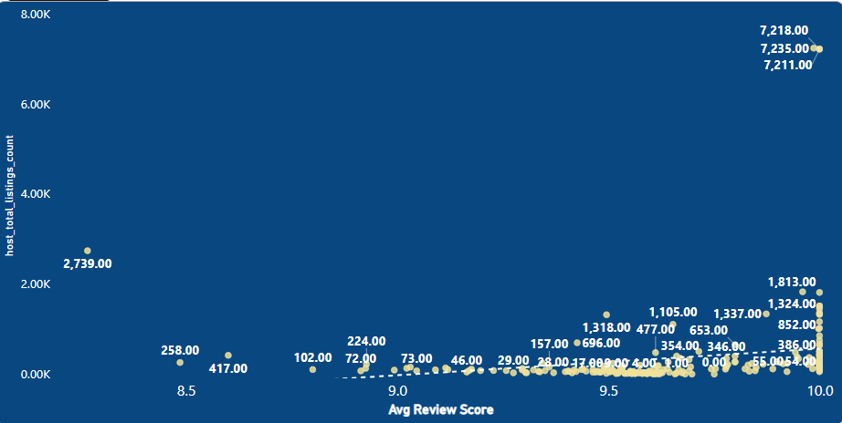

*Graphique de la dispersion du nombre de listings par hôte par rapport au score global*


### 8. Les caractéristiques sont le plus demandées pour les propriétés les plus sollicitées 

Parmi les types de propriétés les plus sollicitées et les plus rentables, il y a un certain nombre de caractéristiques qui reviennent, en terme d'amménagements (ammenities)

Les graphiques ci-dessus permettent de visualiser les types de d'amménagement les plus demandés.

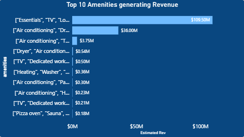

*Graphique du top 10 des types d'aménagment les plus rentables*

Les amménagements qui génèrent le plus de revenus sont les plus sollicités

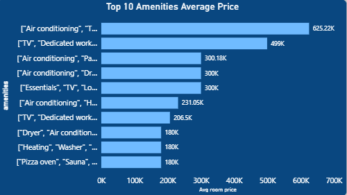

*Graphique du top 10 des types d'aménagment les plus chères* 
On évalue par rapport au prix moyen d'un appartment


### 9. La contribution au CA estimé 

#### 1. PAr type de propriété

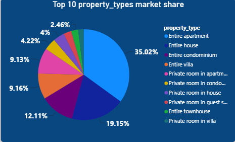

#### 2. par région, ville, par neighbourhood ou par quartier ?

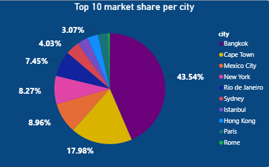

*Les 10 plus grandes part de marché par ville*


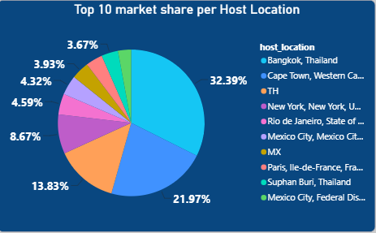

*Les 10 plus grandes part de marché localisation de l'hôte*

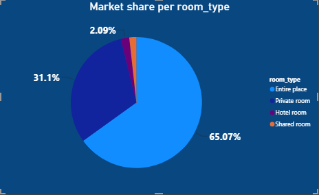

*Les 10 plus grandes part de marché par type de pièce*


*Les 10 plus grandes part de marché par type de chambre (room type)*


On peut continuer ces visulaisation en appliquant sur le dashboard **Power BI** les filtres neighbourhood et district (quartier et voisinage) pour avoir une disposition claire de ce qui se passe localement.

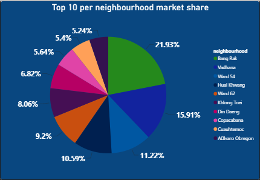

*Les 10 plus grandes part de marché par type de de voisinage*

### 10. Prévisions, Insights et recommandations

Les observations efectuées permettent constater que sur un peu plus de 13 ans d'activité, les performances ne sont pas fameuses, 1.56 Milliards $ soit environ de 130 M $ par ans en moyenne, dont les les années les plus rentables ont été 2014, 2015 et 2016 ayant cumulés respectivement 185, 327 et 351 M $, mais la croissance de revenu a été beaucoup plus importante entre 2008 et 2012 avec une explosion de revenu entre 2008 et 2012. Mais pris sur toute la période de façon générale la croissance de revenu estimé calculé comme précisé plus haut à partir du nombre minimum de nuits se chiffre à seulement 0.19% avec des périodes de boom en avant et en arrière. telles que représenté sur le graphique ci-dessous:

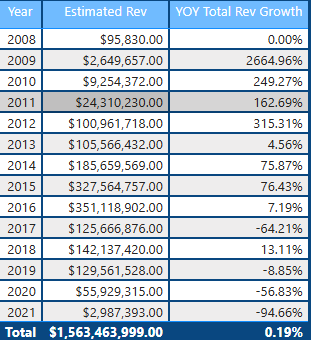


*Talbeau de la croissance du revenu estimé au cours de la période d'activtié*


De cette analyse ressort des tendences assez inhabituelles, premièrement en termes de revenus généré il est clair que les régions, les localisation les plus rentables, celles ayant généré les plus grands revenus ne sont pas les destinations occidentales, mais bien les destinations dites des pays éméergents. ces pays sont certainement par leurs situations économiques climatiques ou peut-être géopolitiques plus attractives par rapport aux autres; 
En terme de type de propriété,  les villas entières et les chambres privées sont les plus chères et les plus demandées, avec suivants les amménagements intégrés. 
Pour ce qui sont des hôtes, les hôtes au nombre élevé de listings (propriétés) sont à favoriser, car ils sont les plus accessibles et les plus à même de conclure des accords de location, et sont ceux qui générent le plus de revenus à l'entreprise, comme le montre l amatrice de corrélation ci'dessous:

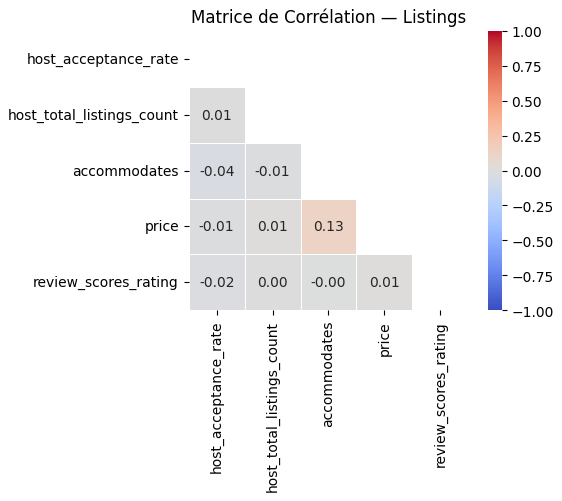

*Matrice de corrélation des listings*


#### L'analyse prévisionnelle effectué à partir du model prophet et SARIMAX avec et sans saisonnalité  a permis de constater une tendance assez mititgé dans les performances futures de l'entreprise telles que représenté sur le graphique ci-dessous: 

cette observation introduit deux autres métriques ou indicateurs intéréssant: la HLV que j'ai choisi d'appeler HLV (Host life value) la valeur moyenne financière de chaque hôte sur la période d'activité, le churn ou taux d'attrition comme étant la pourcentage d'abondan ou de départ des hôtes, en faisant l'hypothèse d'un coût d'acquisition des hôtes constant.


#### Merci de d'avoir jeté un coup d'oeil à ce travail, réalisé avec des moyens et informations limitées, mais toute fois en se basant sur les données disponibles, les analyses exploratoires de données déjà effectuées, j'ai pu me permettre de schématiser dans un certain ordre cette analyse. C'est une étude publique (open source) et donc je suis ouvert à d'éventuelles corrections, améliorations de la part de mes pairs, j'espère vraiment recevoir vos avis (les analystes confirmés) via mon mail: (https://japhetdj192@gamil.com)


